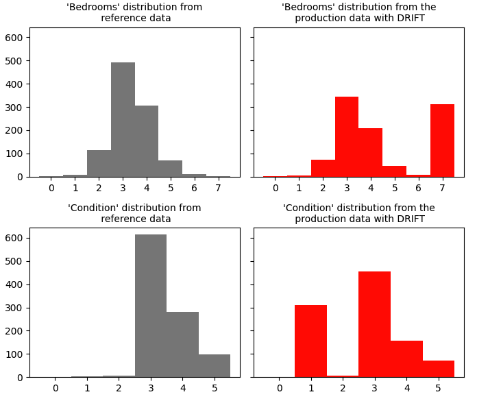
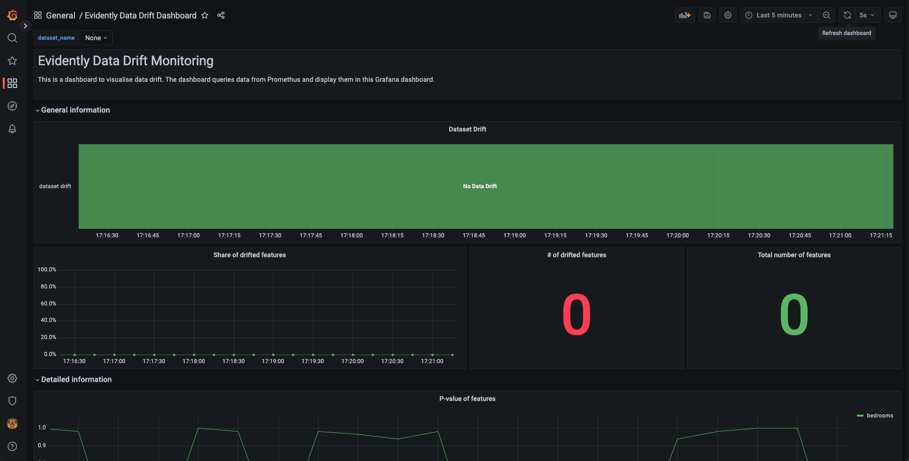

# Introduction

This repo is a complete demo of real-time data monitoring using Evidently. Using a Random Forest Regressor to predict house prices and simulate data drift by sending drifted feature(s) to the model. Evidently calculates the metrics for data drift, send them to Prometheus and demonstrate these on a pre-built Grafana dashboard.

# Outline

<!-- TODO: add detail to this description -->

Within the repo, you will find:

* [`data`](#data): contains two scripts. Running the `get_data.py` will automicatically download a house sale prices dataset from Kaggle for model training and data monitoring (drift monitoring); the dataset is saved to this directory. The `generate_dataset_for_demo.py` script will split the house sale prices dataset into a production and a reference dataset which will be saved to a new directory named `datasets`.
* `pipeline`: a model training script which will use the reference data to create and train a Random Forest Regressor model.
* `inference_server`: a model server that exposes our house price model through a REST API.
* `monitoring_server`: an Evidently model monitoring service which collects inputs and predictions from the model and computes metrics such as data drift.
* [`scenarios`](#scenario): Two scripts to simulate different scenarios. A scenario where there is no drift in the inputs and a scenario which the input data contains drifted data.
* [`dashboards`](#dashboards): a data drift monitoring dashboard which uses Prometheus and Grafana to visualise Evidently's monitoring metrics in real-time.
* A `run_demo_no_drift.py` script to run the demo **with no data drift** using docker compose.
* A `run_demo_drift.py` script to run the demo **with data drift** using docker compose.
* A docker-compose file to run the whole thing.

# Running locally

## Pre-requisites

You'll need Python 3, and Docker and Docker Compose.

## Getting started

1. **Download and install [Docker](https://www.docker.com/) if you don't have it.**

2. **Clone this repo:**
```bash
git clone git@github.com:fuzzylabs/evidently-monitoring-demo.git
```

3. **Go to the demo directory:**
```bash
cd evidently-monitoring-demo
```

4. **Create a new Python virtual environment and activate it.** For Linux/MacOS users:

```bash
python3 -m venv demoenv
source demoenv/bin/activate 
pip install -r requirements.txt
```

## Jupyter Notebook or Terminal

From this point, you have the option to continue the demo by following the instructions below or you continue this demo with [`demo.ipynb`](https://github.com/fuzzylabs/evidently-monitoring-demo/blob/secondFeature/demo.ipynb) (included in this repo) using Jupyter Notebook. The notebook will provide an breif explanation as we go through each steps. Alternatively, you can check out [**How does the demo works?**](#explain) to see how each individual component works with each other and how are the datasets generated.

## Download and prepare data for the model

NOTE: If you already have Kaggle API token set up on your machine, you can skip step 1 and go to [step 2](#step2)

1. **Get and set up Kaggle API token:**

- Go to [Kaggle](https://www.kaggle.com) to log in or create an account.
- Get into your account settings page.
- Under the API section, click on `create a new API token`.
- This will prompt you to download the `.json` file into your system.
- You can either export your Kaggle username and token to the environment. Open the file, copy the username and key and:

```bash
export set KAGGLE_USERNAME=<your-kaggle-username>
export set KAGGLE_KEY=<your-kaggle-api-key>
```

- Or move the downloaded `kaggle.json` file:

```bash
mv ~/Downloads/kaggle.json ~/.kaggle/kaggle.json
```

2. **Run the `get_data.py` script**: <a name="step2"></a>

```bash
python data/get_data.py
```

This will download and save the data from Kaggle.

3. **Split the dataset into production and reference**:

```bash
python data/generate_dataset_for_demo.py
```

This will split the dataset into reference and 2 production datasets, one with drifted data and one without.

- To monitor data drift or outliers, etc.., two datasets are required to perform comparison. The house price data downloaded from Kaggle is split into a reference and a production dataset. The reference dataset is used as the baseline data and for training the model. The second dataset is the current production data which will be used to compared against the reference dataset to identify data drift. The production dataset does not include the price column as the price will be predicted by the regression model. The scripts will create two scenarios of production data, one with data drift and one without.

## Training the Random Forest Regressor

1. **Run the `train.py` script to train the model**:

```bash
python pipeline/train.py
```
- Once the model is trained, it will be saved as `model.pkl` inside the `models` folder.

## Running the demo

**At the moment, there are two scenarios we can simulate by running the demo:**

- **Scenario 1:** No data drift

```bash
python run_demo_no_drift.py
```

OR

- **Scenario 2:** Data drift

```bash
python run_demo_drift.py
```

Once docker compose is running, the demo will start sending data to the inference server for price prediction which will then be monitored by the Evidently metric server.

The metric server will receive the price prediction along with the feature(s) (model inputs) used for the prediction. The features are used to monitor data drift by Evidently using the data drift monitor.

The metrics produced by Evidently will be logged to Prometheus's database which will be available at port 9090. To access Prometheus web interface, go to your browser and open: http://localhost:9090/

To visualise these metrics, Grafana is connected to Prometheus's database to collect data for the dashboard. Grafana will be available at port 3030. To access Grafana web interface, go to your browser and open: http://localhost:3000/ . If this is your **first time using Grafana**, you will be asked to enter a username and password, by default, both the username and password is "admin".

To stop the demo, press ctrl+c and shut down docker compose by running the following command:

```bash
docker-compose down
```

## How does the demo works? <a name="explain"></a>


The demo is comprised of 5 core components:

- Scenario scripts <a name="scenario"></a>: within the `scenarios` folder, it contains two scripts namely `drift.py` and `no_drift.py`. Both scripts send production data to the model server for price prediction. The difference between the two is that one would send data from the `production_no_drift.csv` and the other would send data from the `production_with_drift.csv` which contains drifted data.

- The inference server: this is a model server that will return a price prediction when a request is sent to the server. The request would consists of the features of a house such as the number of bedrooms, etc... After a prediction is made by the model, the server would send the predictions along with the features to the metric server.

- The Evidently metric server: this is the Evidently metrics server which will monitor both the inputs and outputs of the inferenece server to calculate the metrics for data drift.

- Prometheus: once the Evidently monitors have produced some metrics, they will be logged into Prometheus's database as time series data.

- Grafana: this is what we can use to visualise the metrics produced by Evidently in real time. A pre-built dashboard for visualising data drift is include in the `dashboards` directory.

### How are the data generated? <a name="data"></a>

Within the `datasets` folder, 1 reference and 2 production datasets were generated (drift & no drift).

For the no data drift production dataset, the number of bedrooms and the condition features for each row of data is generated using the same distribution as the reference dataset to ensure that no data drift will be detected.

For the data drift dataset, both the number of bedrooms and the condition features are generated using a skewed distribution of the the reference's dataset. E.g. At Looking at the reference dataset, if 7 bedrooms has the lowest probability distribution, then the `generate_dataset_for_demo.py` script will generate a value of 7 to simulate data drfit.

Once the datasets are generated, the Random Forest Regressor is trained using the reference dataset.

### Histogram visualisation

Distribution comparison between the reference datasets and the **non-drifted** production dataset:


Distribution comparison between the reference datasets and the **drifted** production dataset:



### The dashboards <a name="dashboards"></a>



- When the no data drift scenario is running, the Grafana's dashboard should show no data drift is detected. However, as there are some randomness in dataset generation, it is possible to see data drift every once a while.


- When the data drift scenario is running, Grafana's dashboard should show data drift at a relatively constant time frame, e.g. no data drfit for 10 seconds -> data drift detected for 5 seconds -> no data drift for 10 seconds etc...