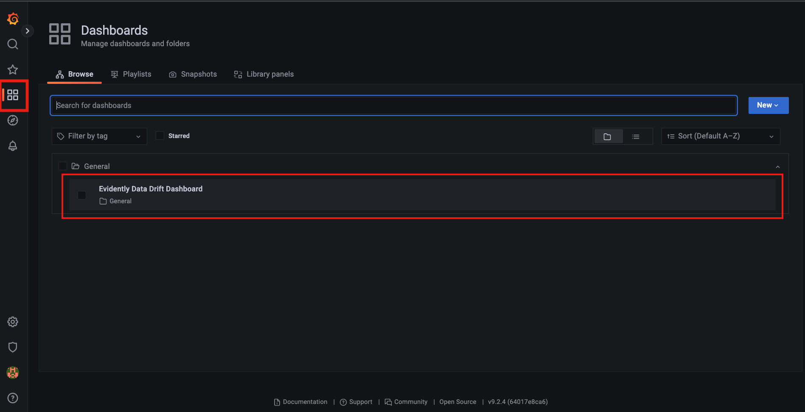
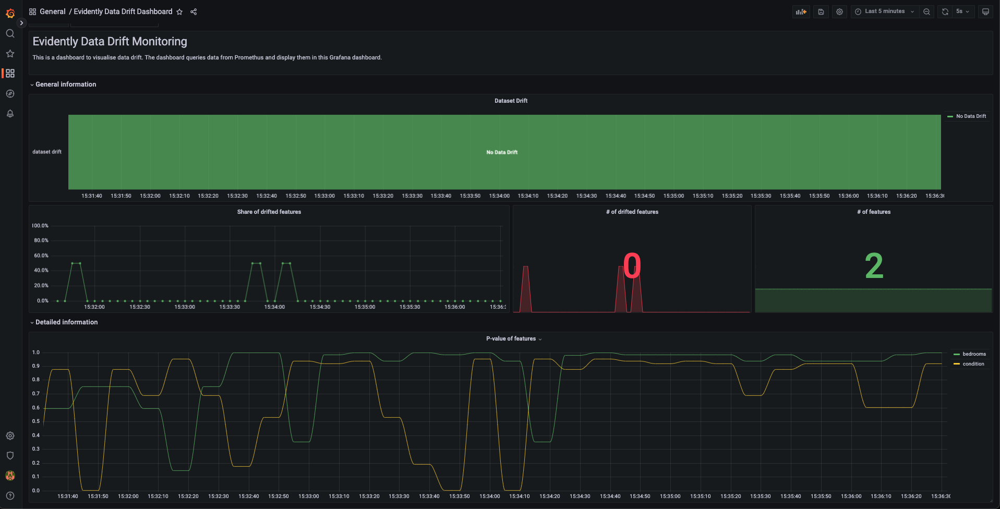
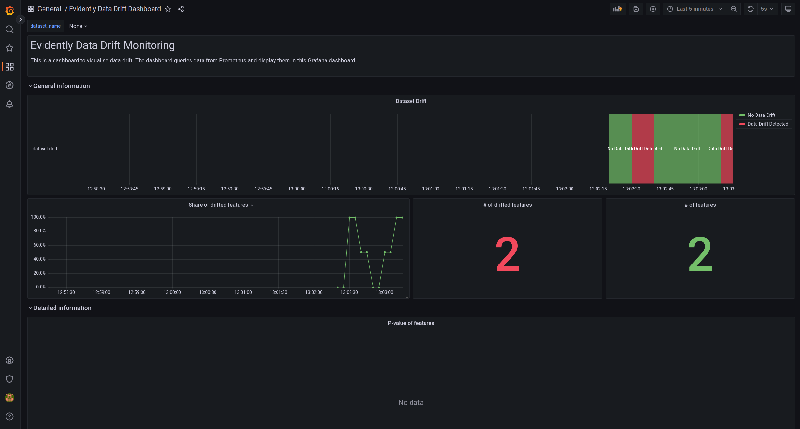

# Introduction

This repository is a complete demo of real-time data monitoring using Evidently. Using a Random Forest Regressor to predict house prices and simulate data drift by sending drifted feature(s) to the model. Evidently calculates the metrics for data drift, sends them to Prometheus and visualize the results using a pre-built Grafana dashboard.

# Contents

- [Introduction](#introduction)
- [Contents](#contents)
- [Project Outline](#project-outline)
- [Running locally](#running-locally)
  - [Pre-requisites](#pre-requisites)
  - [Getting started](#getting-started)
  - [Jupyter Notebook](#jupyter-notebook)
  - [Prepare Demo](#prepare-demo)
  - [Run demo](#run-demo)
    - [No drift Scenario](#no-drift-scenario)
    - [Drift Scenario](#drift-scenario)
    - [Stop demo](#stop-demo)
  - [Conclusion](#conclusion)
  - [Further Readings](#further-readings)

# Project Outline

Within the repo, you will find:

- [`pipeline`](pipeline): a model training script which will use the reference data to create and train a Random Forest Regressor model.
- [`inference_server`](server/model_server): a model server that exposes our house price model through a REST API.
- [`monitoring_server`](server/monitoring_server): an Evidently model monitoring service which collects inputs and predictions from the model and computes metrics such as data drift.
- [`scenarios`](scenarios): Two scripts to simulate different scenarios. A scenario where there is no drift in the inputs and a scenario which the input data contains drifted data.
- [`dashboards`](dashboards): a data drift monitoring dashboard which uses Prometheus and Grafana to visualise Evidently's monitoring metrics in real-time.
- [`run_demo.py`](run_demo.py) script to run the demo using docker compose.
- [`prepare_demo.py`](prepare_demo.py) script to prepare datasets required for running demo.
- [`utils`](utils): Folder containing utility scripts for docker and preparing datasets.
- [`notebook`](notebook): Folder containing Jupyter Notebook for running the demo.

# Running locally

## Pre-requisites

You'll need following pre-requisites to run the demo:

- [Python 3](https://www.python.org/downloads/)
- [Docker](https://docs.docker.com/engine/install/)
- [Docker Compose V2](https://docs.docker.com/compose/install/).

## Getting started

1. Clone this repo:

    ```bash
    git clone https://github.com/fuzzylabs/evidently-monitoring-demo.git
    ```

2. Go to the demo directory:

    ```bash
    cd evidently-monitoring-demo
    ```

3. Create a new Python virtual environment and activate it. For Linux/MacOS users:

    ```bash
    python3 -m venv demoenv
    source demoenv/bin/activate
    pip install -r requirements.txt
    ```

## Jupyter Notebook

From this point, you have the option to continue the demo by following the instructions below or you continue this demo with [`demo.ipynb`](notebooks/demo.ipynb) (included in this repo) using Jupyter Notebook. The notebook will provide an breif explaination as we go through each steps.

## Prepare Demo

This step prepares dataset required to run demo. It creates 1 reference and 2 scenarios (drift and no-drift) production datasets inside `datasets` directory. All the steps described below can be combined and ran using the command below or individually step by step.

```bash
python prepare_demo.py --download --prepare --train
```

To know more in detail each of the step below, please read section [Scenarios](docs/Concepts.md/#scenarios) in  [Concepts.md](docs/Concepts.md).

Next, we explain each individual step taken to prepare datasets required for running the demo.

1. This step will download and preprocess the data from Google drive.

    ```bash
    python prepare_demo.py --download
    ```

2. This step will split the dataset into 1 reference and 2 production datasets (with drift data and without drift data). Jump to section on [How are the data generated?](docs/Concepts.md/#how-are-the-data-generated) to understand the motivation behind these datasets.

    ```bash
    python prepare_demo.py --prepare
    ```

3. Train a Random Forest Regressor. This model will be used by Inference Server (explained [here](docs/Concepts.md/#inference-server)) to make predictions. Once the model is trained, it will be saved as `model.pkl` inside the `models` folder.

    ```bash
    python prepare_demo.py --train
    ```

## Run demo

In this demo, we will perform ML monitoring using Evidently, Prometheus and Granfana using the dataset prepared on last section. We will monitor drift detection in real time. The different services exposed by docker compose application are

- [Inference server](docs/Concepts.md/#inference-server) at port 5050: <http://localhost:5050/>
- [Evidently monitoring service](docs/Concepts.md/#evidently-server) at port 8085: <http://localhost:8085/>
- [Prometheus](docs/Concepts.md/#prometheus) at port 9090. To access Prometheus web interface, go to your browser and open: <http://localhost:9090/>
- [Grafana](docs/Concepts.md/#grafana) at port 3000. To access Grafana web interface, go to your browser and open: <http://localhost:3000/>

Click on the individual services to read more about it further.

To run the 4 services using docker, run

```
docker compose up --build
```

This will start a docker compose application in the background that runs all the tools Evidently, Prometheus and Grafana together.

### No drift Scenario

Let us first start with a **no-drift scenario**. The reference dataset and no drift dataset have same distribution.

On a new terminal, run

```bash
docker compose run --rm --service-ports scenario_runner --no-drift
# press control+c to stop this scenario
```

 Once the no drift scenario is started, we can see the results on Grafana dashboard at <http://localhost:3000/>.

> ### **_NOTE:_**  The default login credentials for Grafana are **username: "_admin_"** and **password: "_admin_"**.

To see the monitoring dashboard in the Grafana interface, click "General" and navigate to the chosen dashboard (e.g. "Evidently Drift Monitoring"). Under the dashboard, you will see a graph that shows the drift detection results.



The no drift scenario shows that currently there are 2 features and no drift is detected for either of features:



To stop this scenario, press `control+c` together. This will act as a Keyboard Interrupt. All the container will still remain running in the background as we did not stop the docker compose application yet.

### Drift Scenario

Next we start with a **drift scenario**. The reference dataset and drift dataset come from a different distribution. Hence, Evidently library will notice a drift and alert with number of features drifted on the Grafana dashboard.

```bash
docker compose run --rm --service-ports scenario_runner --drift
# press control+c to stop this scenario
```

This will use the already running container for Evidently, Prometheus and Grafana. The drift detection results will be shown on Grafana dashboard at <http://localhost:3000>.

Under the same dashboard, the graph will show that there are 2 features that are drifted.



To stop this scenario, press `control+c` together. This will act as a Keyboard Interrupt. All the container will still remain running in the background as we did not stop the docker compose application yet.

### Stop demo

To stop the demo, we need to stop the docker compose application. This can be done by running the following command. This will stop docker compose application and remove the all the containers.

```bash
docker compose down
```

To understand how all these services work together, please refer to [Concepts](docs/Concepts.md) document.

## Conclusion

Since we wanted to a complete real-time monitoring solution that mirrors MLOps in production use case, we use Prometheus and Grafana alongside Evidently library. Briefly how all this works is

- We create a reference dataset which is subset of original dataset using 2 features ["bedroom", "condition"]. For simplicity of the demo, we reduce the datapoints and features of the original dataset.
- We simulate two production datasets. First no drift production data contains same feature distribution as reference dataset. Second drift production data will contain different feature distribution compared to reference dataset.
- Evidently library requires a reference dataset as a benchmark. It analyzes the change by comparing the production data to the reference data.
- Evidently library calculates the data drift metrics between production and reference dataset. This metric is sent to Prometheus which stores the metrics.
- Grafana library is used to scrape the metrics from Prometheus and build a dashboard around it. This dashboard shows the data drift metrics for the dataset.
- Docker compose is used to tie all these services together.

To read more detailed description on all steps involved in the demo, please refer to [Concepts](docs/Concepts.md) document. There are few recommendations as well on how to modify this application to your specific ML application. It also includes some best practices for production use.

## Further Readings

- [Real-time ML monitoring with Evidently and Grafana](https://github.com/evidentlyai/evidently/tree/main/examples/integrations/grafana_monitoring_service)
