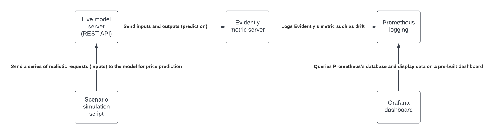
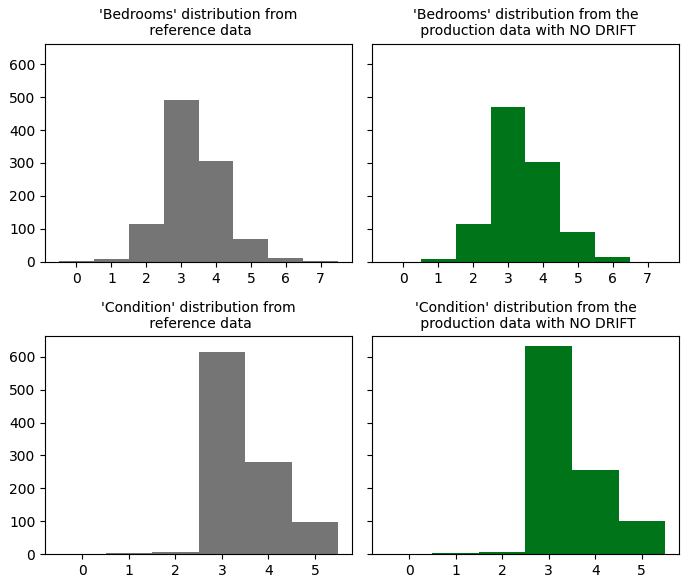
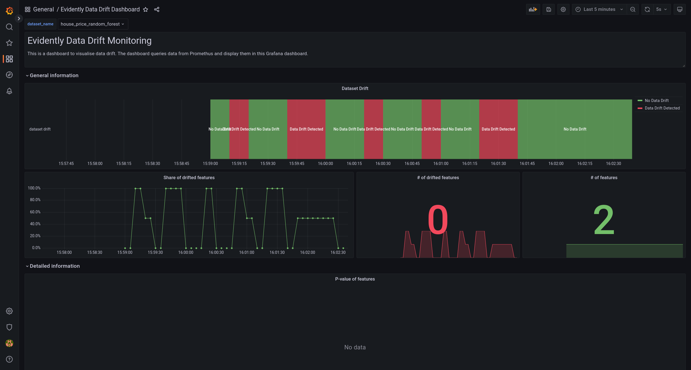
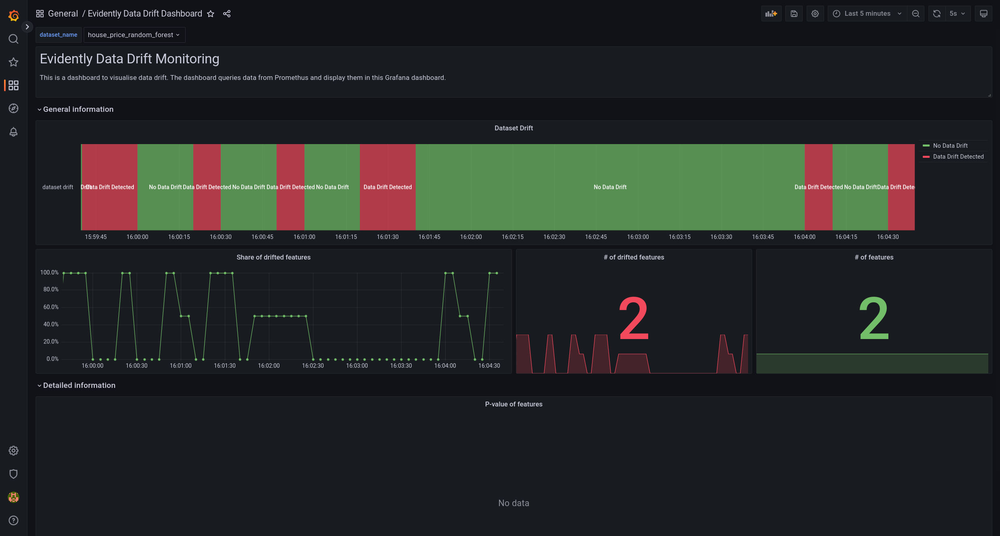

# How does the demo work?



The demo is comprised of 5 core components:

- [Scenarios](#scenarios)
  - [How are data generated?](#how-are-the-data-generated)
  - [Histogram Visualization](#histogram-visualisation)
- [Inference server](#inference-server)
- [Evidently server](#evidently-server)
- [Prometheus](#prometheus)
- [Grafana](#grafana)

## Scenarios

This demo makes use of the Kaggle dataset [House Sales in King County, USA](https://www.kaggle.com/datasets/harlfoxem/housesalesprediction). The dataset includes homes from between May 2014 to May 2015. The dataset contains 21,613 rows and 21 columns that represent the features of the homes sold. The Kaggle dataset has been uploaded to Google Drive for easy access.

### How are the data generated?

- Download and Preprocess data Step

    ```bash
    python prepare_demo.py --download
    ```

    This step downlaods the Kaggle dataset as a zip file "housesalesprediction.zip" inside `datasets` folder. The downloaded zip file will be extracted as "kc_house_data.csv". Finally, to help Evidently to process the input data, the `date` column of `kc_house_data.csv` will be converted to a pandas datetime object and a new dataset will be saved as `processed_house_data.csv` inside the same folder.

- Prepare datasets step

    ```bash
    python prepare_demo.py --prepare
    ```

    To monitor data drift or outliers, Evidently requires at least two datasets to perform comparison, a production dataset and a reference dataset. Using `processed_house_data.csv` from previous step, this script will create two scenarios of production data, 1 with data drift, 1 without data drift. The reference dataset is first 1000 rows of original dataset. The original dataset downloaded contains 21 features. To simplify this demo and make it easier to understand what is happening, we are only going to select 2 features from the original dataset i.e. ["bedroom", "condition"] columns are selected.

    The reference dataset is used as the baseline data by Evidently. Since we do not have a actual house selling website, the production dataset will simulate live data which will be used to compared against the reference dataset to identify data drift. Production datasets do not include the price column as the price will be predicted by a regression model.

    The distribution of each feature is computed using the the [compute_dist](https://github.com/fuzzylabs/evidently-monitoring-demo/blob/master/utils/prepare_demo.py#L37) function which returns a dictionary of probabilty distribution. For example, if 50% of the bedroom has a value of 2, 30% has a value of 3 and 20% has a value of 4. Then, the `compute_dist` function would return a dictionary of {2: 0.5, 3: 0.3, 4: 0.2}. For the no data drift production dataset, the number of bedrooms and the condition feature for each row of data is generated using the same distribution as the reference dataset to ensure that no data drift will be detected.

    These feature distribution will be used to create a value generator object using the `ProbDistribution` class within the [prob_distribution.py](../utils/prob_distribution.py). When a generator object is initialised, it will compute a skewed distribution based on the orginal probability distribution. For example, using the example bedroom distribution {2: 0.5, 3: 0.3, 4: 0.2}. The generator will skew the distribtuion by changing the probability of each value. To ensure drift will be detected for this demo, the value with the lowest probability will have a proability of 1 after skewed. The skewed distribution will be stored as a dictionary {2: 0.0, 3: 0.0, 4: 1.0} as an attribute of the generator object.

- Train Random Forest Regression Model.

    ```bash
    python prepare_demo.py --train
    ```

    Once the datasets are generated, the Random Forest Regressor is trained using the reference dataset with [train.py](../pipeline/train.py).

    Within the [`scenarios`](../scenarios) folder, there are two scripts namely [`drift.py`](../scenarios/drift.py) and [`no_drift.py`](../scenarios/no_drift.py). Both scripts send production data to the model server for price prediction. The difference between the two is that one would send data from the `production_no_drift.csv` for no-drift scenario and the other would send data from the `production_with_drift.csv` which contains drifted data for drift scenario.

### Histogram visualisation

In this section, we visualize the historgram for 2 features in our toy dataset. We compare the histogram for drift and no-drift scenarios against reference dataset to visualize what the distribution looks like.

**Distribution comparison between the reference datasets and the non-drifted production dataset**



The histogram above shows that for the bedroom feature, 7 bedrooms appears the least meaning that it has the lowest probabilty of being generated in the no data drift production dataset.

**Distribution comparison between the reference datasets and the drifted production dataset**


The histogram above shows that for the bedroom feature, 7 bedrooms appears much more frequently compare to the no data drift production dataset.

## Inference server

- This is a model server that will return a price prediction when a request is sent to the server. The request would consists of the features of a house such as the number of bedrooms, etc... After a prediction is made by the model, the server would send the predictions along with the features to the metric server.

## Evidently server

- The Evidently metric server: this is the Evidently metrics server which will monitor both the inputs and outputs of the inference server to calculate the metrics for data drift.
To simplify this demo and make it easier to understand what is happening, we are only going to select 2 features from the original dataset

## Prometheus

- Prometheus: once the Evidently monitors have produced some metrics, they will be logged into Prometheus's database as time series data.

## Grafana

- Grafana: this is what we can use to visualise the metrics produced by Evidently in real time. A pre-built dashboard for visualising data drift is include in the [`dashboards`](dashboards) directory.

### The dashboards



- When the no data drift scenario is running, the Grafana's dashboard should show no data drift is detected. However, as there are some randomness in dataset generation, it is possible to see data drift every once a while.



- When the data drift scenario is running, Grafana's dashboard should show data drift at a relatively constant time frame, e.g. no data drift for 10 seconds -> data drift detected for 5 seconds -> no data drift for 10 seconds etc...
